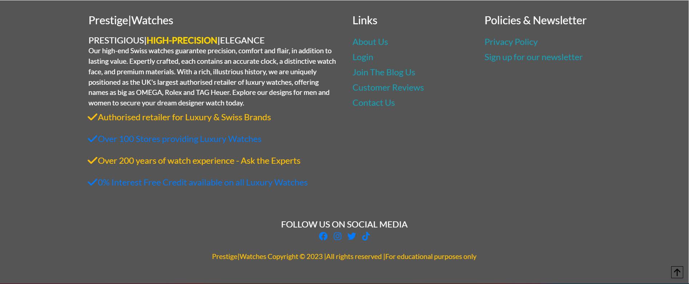

# Project 5 - Prestige|Watches Full Stack Web Developer Ecommerce Project


## Table of content
+ [Introduction](#introduction)
+ [User Experience](#user-experience---ux)
+ [Agile Methodology](#agile-methodology)
+ [Wireframes](#wireframes)
+ [Database Schema](#database-schema)
+ [Color Contrast](#colour-contrast)
+ [Site Features](#site-features)
    + [Favicon Icon](#favicon-icon)
    + [Header](#header)
    + [Footer](#footer)
    + [Site Navigation](#site-navigation)
    + [Home Page](#home-page)
    + [About Us Page](#about-us-page)
    + [Product Page](#product-main-page)
    + [Product Detail Page](#product-detail-page)
    + [Product Shopping Bag Page](#product-shopping-bag-page)
    + [Product Shopping Checkout Page](#product-shopping-bag-page)
    + [Product Shopping Checkout Success Page](#product-shopping-checkout-success-page)
    + [Product Management Page](#product-management-page)
    + [My Profile Page](#my-profile-page)
    + [Blog Page](#blog-page)
    + [Customer Reviews Page](#customer-reviews-page)
    + [Contact us Page](#contact-us-page)
    + [Sign Up Page](#sign-up-page)
    + [Sign In Page](#sign-in-page)
    + [Sign Out Page](#sign-out-page)
    + [Error 404 Page](#error-404-page)
    + [Admin Page](#admin-page)
+ [User Interaction Messages](#user-interaction-messages)
+ [Future Features](#future-features)
+ [Web Marketing](#web-marketing)
    + [Facebook Page](#social-media)
    + [Search engine optimization](#search-engine-optimization)
         + [Sitemap.xml](#sitemap.xml)
         + [Robots.txt](#robots.txt)
    + [Mailchimp Email marketing](#mailchimp-email-marketing)
+ [Testing](#testing)
+ [Technologies](#technologies)
+ [Libraries](#libraries)
+ [Security Features](#security-features-and-defensive-design)
+ [Form Features](#form-feature--validation)
+ [Database Security](#database-security)
+ [Deployment](#deployment)
    + [Local Deployment](#local-deployment)
    + [Heroku Deployment](#heroku-deployment-initial-stage-as-advised-by-code-institute)
    + [Elephant Postgressql](#postgresql-database-elephantsql)
    + [Github](#github)

+ [Credits](#credits)
+ [Acknowledgement](#acknowledgement)


## Introduction
```diff 
Prestige|Watches A Full Stack Web Development for the Eccommerce Module Project using (Create, Read, Update, Delete)
```

This project is a B2C e-commerce store that is designed and implemented with Python and Django, HTML, CSS and some Javascript. Prestige Watches is online ecommerce store. The store allows the user to purchase a item, view blogs, make comments on blogs, add and delete customer reviews and sign up to newsletters. 

Some the key functions of the services are as below:
+ Purchase Items From The Online Store.
+ Login, Logout and Register Facility.
+ Admin to create, read, edit and delete Products.
+ Users to create, read, edit and delete reviews. 
+ Create feedback via the Contact Us Page.
+ About Us page.
+ User to view blogs and able to like blogs.
+ User to create comments, and function to delete comments. 
+ User to be able to like comments.


[View link to my project 5](https://prestige-watches.herokuapp.com/)


## User Experience - UX
+ Site User Experience
1. As a site user I can create or edit my account so that I can update my details accordingly
2. As a site user I can login in my account so that I can view my order history
3. As a site user I can search for products so that I can find specific products
4. As a site user I can sort products on criteria such as price and category so that I can I have a method of ordering the products which I prefer.
5. As a site user I can browse through products so that I can decide what I may be interested in buying
6. As a site user I can look at product details so that I can decide if I want to purchase it
7. As a site user I can easily add products I want to purchase to a basket so that I can decide whether to purchase or not
8. As a site user I can view the contents of my shopping basket so that I can be able to make any adjustments, if required. 
9. As a site user I can update my bag by adding more or remove products so that I can decide on the number of products I intend to buy
10. As a site user I can view my order summary so that I can verify it before confirming
11. As a site user I can checkout securely so that I can I maintain the level of trust on the site
12. As a site user I can view paginated posts so that I can select which posts to view
13. As a site user I can view all posts so that I can decide what I may be interested in reading
14. As a site user I can comment to the blog posts so that I can express my opinion to the post
15. As a site user I can use the contact form so that I can contact the site owners
16. As a site user I can sign up to newsletter so that I can keep updated on the latest news
17. As a site user I can add, view, delete and edit reviews which customers can view on the main site. 
18. As a site user I can read the sites About us page
19. As a site user I can like blogs and comments created by other users.
20. As a site user I can view paginated reviews so that I can select which review to view.


+ Site Admin Experience
1. As a admin I can manage users' accounts so that I can make any required changes to them if needed
2. As a admin I can manage products so that I can add , update or delete products when necessary
3. As a admin I can view created orders so that I can full fill the orders or ammend if needed
4. As a Admin I can delete any of comments so that I can remove them if I no longer feel they are still necessary or needed
5. As a Admin I can view messages sent via contact form so that I can act upon them
6. As an admin I can manage and create blogs for users to view and like. 
7. As an admin I can manage the blog comments so that I can make amendments if needed
8. As an admin I can manage the review page so that I can make amendments if needed
9. As an admin I can manage the Facebook page in order to attract further customers. 


## Agile Methodology
An Agile Approach was used to develop this site. This was achieved by breaking the project down into smaller tasks.
To complete the overall aim of the website, 21 issues were created as specific tasks called User Stories. These User Stories are small sections of the project designed to accomplish a specific goal. Once the User Story was working effectively it was moved across the Kanban board, in the following working order. 
+ To do
+ In Progress
+ Done


All my user stories were completed and succesfully actioned. The design was based on the Agile Methodology.


 My Projects and User Stories can be viewed here :  [Issues and Projects](https://github.com/users/Shanbashir1/projects/6/views/1 "Github Issues")


 ## Wireframes
Balsamiq wireframes was used to design the wireframes in the design phase of this project. [Balsamiq Wireframes - Click here to view the wireframes](https://balsamiq.cloud/sbwg9ys/pn79h8b/r2278?f=N4IgUiBcCMA0IDkpxAYWfAMhkAhHAsjgFo4DSUA2gLoC%2BQA%3D "Click here to view the wireframes")
The wireframes was edited a few times during the project to be inline witht he project design, I had to make a few adjustments to the design, in order for the design to work. 

+ Home Page design


+ Product Page design


+ Checkout design


+ Blog Page design


+ Review Page design


+ Contact Page design


## Database Schema
Lucid Charts was used to design the unique models used in this project.


## Colour Contrast
The selection of the colours for the web page was chosen from Color Hex. The colour contrast tried to remain basic and have a good flow of similiar colours throughout the design. However most of my colour code was used via the Bootstrap contrast which was available from the framework, this included colour text and button colours. 


## Site Features

### Favicon Icon 


+ The selected icon was a image of a watch. 
+ The image is displayed on all the pages, throughout the website to give a unique design for the users.
+ The favicon image is a design which contributes to the overall web design.

### Home Page


+ The home page is the first page the user lands on when visiting the site. 
+ The home page user the header and the delivery banner feature but does not include the footer. 
+ The home page has a shop now flashing button, which navigates the user to the product page. 
+ The home page also has flashing text to give the page a special feature. 

### Header


+ The header is located at the top of the page, displaying the logo-text, The sub-heading, the navigation links, the search bar, my account icon and the shopping basket.
+ The color used for the header was #fffff (white), which was one of the main color used throughout the site to display the background and some area of colour text. 
+ The logo text was black, however the sub-heading text had a combination of gold. 
+ The search button had a link reference of selecting items from the product store. 
+ The navigation link bars had scrolls and redirected users to pages through out the site. The navigation link were simple and easy to navigate through out the site. The navigation links bars also had a hover of underline, to clearly display to the user which tab they were hovering over. 
+ The my account icon, directed the user to the login page, logout page and register page. 
+ The basket had the total cost of the items added and navigated the user to the bag page. 
+ Clicking on the logo header will redirect the user to the home page. 

### Delivery Banner 


+ The delivery banner displays to the user a "Free delivery charge on orders over £1000"
+ The banner has been designed using a marquee, with floating text offer the free delivery charge. 
+ A delivery van has been used as the icon for the banner. 
+ The colour contrast has been used of a dark grey background with white text.

### Footer


+ The footer is contrasted in line with the header banner of dark grey with white text, the bootstrap of text-info has been used for the navigation links. 
+ All links direct the users to pages through out the site.
+ The footer is quite detailed for user to explore relevant information while navigating through the site. 
+ The footer contains the following features 
1. Header Logo 
2. Sub Header 
3. Text Description 
4. Navigation Links 
5. Policies and Newsletters 
6. Social Media Links 
7. Copyright 

### Site Navigation


+ Site Navigation is available on both the header and the footer. 
1. All Products, contains the following sub-headings, Price, Rating, Category, All Products, these links navigate the user to the relevant requirements. 
2. Special Offer, contains the following sub-headings, New Arrival, Sale, All Specials these links navigate the user to the relevant requirements. 
3. Join our blog
4. Help contains the following sub-headings, Contact Us, Customer Reviews and About Us these links navigate the user to the relevant requirements. 
5. Account - All Auth, gives the user to Login, Logout, Register
6. Account Admin option - Allows the Admin user to view Product Management, Blog Management, My Profile and Add Reviews.

+ Account Navigation


+ Footer Navigations


### About Us Page
+ The About us page contains information of the companies information and history. 
+ The format is text based and design has been designed using bootstrap. 
+ The about us page contains information a shop now button which redirects the user to the products page. 


### Product Main Page
+ On this page, users will see all the products available on the website. All the watches will be displayed on the main page when the user has selected "All Products" or any other product relating links. 


+ The user will be able to sort the products and filter the requirements they would like to search by
+ Once the user selects the product he will be forwarded to the product detail page.


+ Mobile Devices View


+ If the user sign in via the admin login details they will be able to delete, add and edit the products page. 
+ Admin users will have the complete the rights to change and add products on the page. 


+ Mobile Devices View


### Product Detail Page

+ On this page the user will see the selected products with product descriptions and features. 
+  The user will be able to select the quantity, which can be added and then removed using the "+" and "-" icons. 
+ There will also be 2 buttons, 1 button will allow the user to go back the products page to continue shopping, the other button will take the user to the bags page, displaying the qty and order details.  


### Product Shopping Bag Page
+ This feature is called the Shopping bag. Here, users can add products and quantities. Check the total price, and delivery costs and go to the secure checkout to finish the order. Before secure checkout. the user can also change the quantity and remove unwanted products. The user can also leave this page by pressing the button "Keep Shopping", if the user would like to continue than they will proceed to the "secure checkout" page.


### Product Shopping Checkout Page
+ On this page the user will need to enter his details and credit/debits cards details. The order will also be displayed. The total cost and delivery charges will also be visible to the user. 
+ The user will be able to "adjust the bag" or "complete order" via the buttons. 


### Product Shopping Checkout Success Page
+ Once the user has completed the checkout they will be direct to the success checkout page, with a receipt confirmation and order reference. The order confirmation will be displayed as follows: 
+ Order Info
+ Order Number
+ Order Date
+ Order Details
+ Delivering To
+ Full Name
+ Address 1
+ Town or City
+ Postal Code
+ Country
+ Phone Number
+ Billing Info
+ Order Total
+ Delivery
+ Grand Total


+ Email sent by the server - order confirmation. 


### Product Management Page
+ For Admin only 
+ When the website admin is logged in on this page, they can add a new product to the website without going to the admin panel.


### My Profile Page
+ The profile page is available when the user logs in, the user is able to add his details and view a order history. By adding a profile the user does not need to add his details the next time they place an order, as the information is kept saved.
+ A "Update my delivery info" button is available to the user to acknowlege the changes. 


### Blog Page
+ The blog page is only administrated by the admin, who can add, delete and edit blogs. 
+ The user has the option to like the blogs. Once like the heart will have a number one selected. 


+ The user has option to create, read, update, delete comments. in the comment section. 
+ The user can also like and unlike a comment.


+ Only the admin can add, edit and delete blogs. The blogs can be ammended via the blog management tab, which is located in the "My Accounts" icon. This can also be managed in the admin panel. 


### Customer Reviews Page
+ The customer review page is located in the Help navigation links. The user will scroll down fromt help section and select the customer review page. 
+ All logged in users will be able to created a review. The review will however need to be approved by the admin.
+ Once the review has been approved it will display on the customer review main page. 
+ The customer review page will have show star ratings and a comment section for the customer to express it views. 


+ The user will be able to add a review if they are logged in. The add review tab will be accessible from the "My Account" tab. 
+ The form will be easy to submit for the user 
+ The review will need to be approved by the admin before being allowed to be published. 


+ Admin Reviews - requires approval from the admin, before being published to the site. 


### Contact Us Page
+ A contact us page is available for users who need to get in touch with the store owners. They have to put their name, email, the subject and the overall message before sending the form, which is then sent to the admin for viewing. 


### Sign Up Page
+ For first time users the user will need to register his/her details and submit the form. 
+ The form will then send a email, the user will need to verify the email so they can activate their account. 


+ Verification required via email. With a success message. 


+ Email sent by the server 


+ Once user has accepted the link via his email, they redirected back to the site, and requested to verify the email address. 


### Sign In Page

+ On the Login Page, users can log in to the website by inputting their username and password. The user is now registered and will have access to the Registered User website services.


+ Once signed in the user is naviagted the "Home Page".

### Sign Out Page

+ On the Signout Page, users can confirm that they wish to exit the website.


### Error 404 Page
+ A 404 page is also available to handle navigation errors with a home link button to take them back to the home page


### Newsletter 
+ Users can sign up using their email to receive news, offers and deals straight into their inbox.
+ The newsletter link is located in the footer. 
+ The user will need to subscribe using their email address.


### Privacy Policy
+ The privacy policy is located in the footer 
+ The privacy is a GDPR policy which must be included in to sites which collect data and information of users. 


### Facebook Page
+ In terms of marketing, the site has a facebook page to push content and targets some of it's customers through content creation. 


+ The facebook page targets users and audience to attract further business.


### Admin Page 
+ The admin models contains a list of created models in the app.
+ The admin models has a list of action of data which has been inputed by the user.
+ Admin users have more functionality than regular users and have full CRUD functionality over information such as products, order, blogs, reviews, contact us feedbacks and profile information.
Only approved admin users can access this section of the site. It is accessed by adding /admin to the URL home page and signing in.
+ The admin models have all user information, which was entered during sign in , orders etc. 
+ Inputed data can be deleted and edited by the admin. 
+ Orders, reviews, comments, blog and profile can be viewed by the admin and may requrie some approval before being published on the site. 

+ Main Admin Page - Django Administration


Email Address Admin Page - Django Administration


Blog Admin Page - Django Administration


Order Admin Page - Django Administration


Contact Us Message Admin Page - Django Administration


Product Category Admin Page - Django Administration


Product List Admin Page - Django Administration


Customer Reviews Admin Page - Django Administration


## User Interaction Messages
+ The site benefits from messages which alert the user of action they have completed. Below is not a exhausted list but shows some evidence of messages the user recieves. 

+ Checkout Success page for user ordering online. 


+ Admin succesfully added blog on the blog page 


+ Admin succesfully delete product on the product page


+ Admin succesfully edit product on the product page


+ Customer review successfully waiting approval


+ Customer review successfully deleted


+ New user registers to the site 


## Future Features
While creating the Project, I realised that the vast input I could add to the design to allow it to have more functionalities. As we have all learnt the timescope involved limits the overall scope.

What I could possibily add as a Future Feature? 

1. Add more variety of products and create better categories for user to apply its search facilities. 
2. Better products layout, with the limited time scope I was not abel to cut the images to the correct length, which resulted in the images being slighly off design and scope. However with limited time and resources the images would be much more user friendly. 
3. User being able to add comments and reviews on the products page .
4. Generally so much to add, to make the site much more efficient and user friendly. 

## Web Marketing 

### Social Media
+ A facebook page was created to build community from the target market. Facebook is free and it also takes little to no time to set up and also it has so many users whom a business can strive to maintain a certain relationship, create content and connect with a target audience. 


### Search engine optimization
+ Keywords SEO are important for search engines to pick up keywords while users are searching online. 
+ Below are some of the keywords I have used for the site 


#### Sitemap.xml 
+ A sitemap file with a list of important URLs was added to ensure that search engines are able to easily navigate through the site and understand its structure. This was made using XML-sitemaps.com by following the steps:
1. Paste the URL of the deployed site into XML-sitemaps
2. Download the XML sitemap file
3. Add the file into the projects root folder, named as sitemap.xml

#### Robots.txt
A robots.txt file was created to tell search engines where not to go on the website and increase the quality of the site, ultimately improving the SEO rating.

### Mailchimp Email Marketing
+ Users can subscribe to newsletters by entering their email address.
+ Email Marketing can alert users to special offers and important information. 
