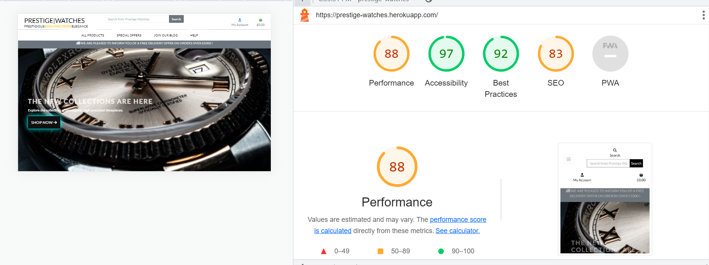
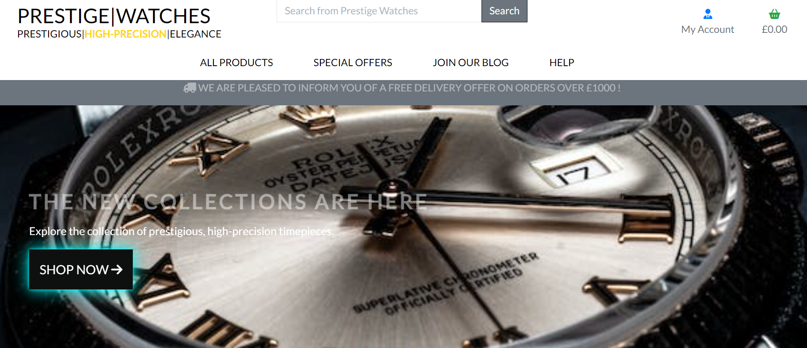
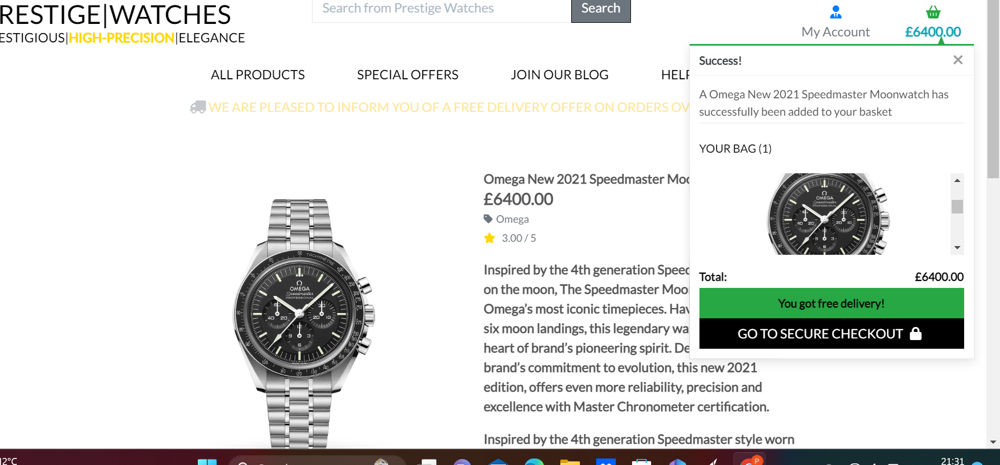
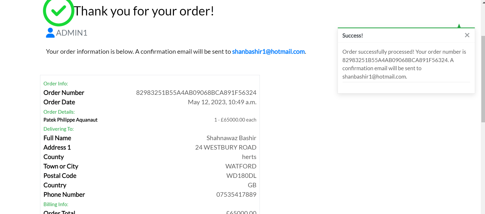
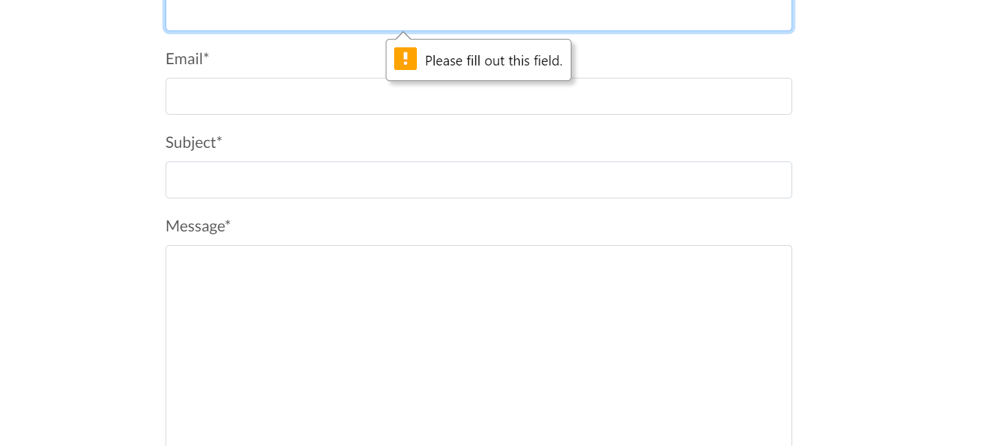
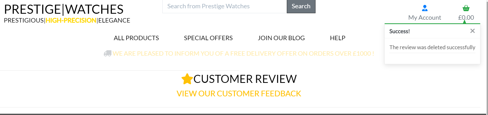
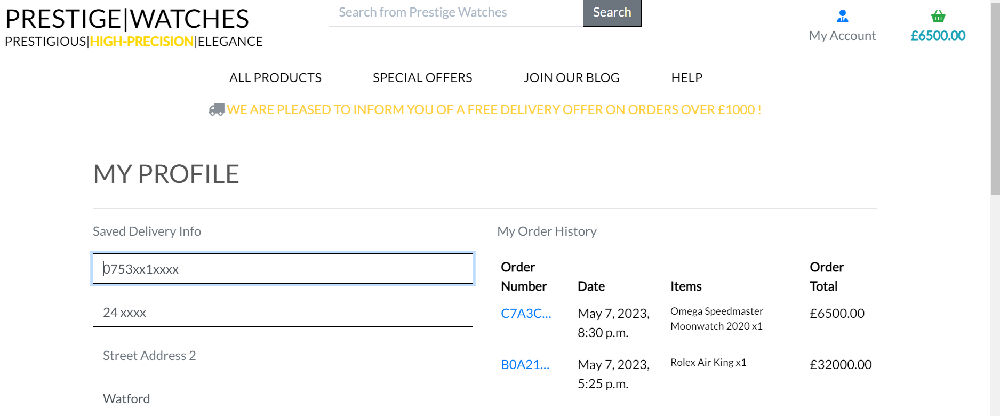

# Project 5 - Prestige|Watches Full Stack Web Developer Ecommerce Project

## Table of content

+ Validation Testing 
    + HTML
        + [NU-HTML-CHECKER](#html-testing-using-nu-html-checker)
    + CSS
        + [W3-JIGSAW.ORG](#css-validator-using-jigsaww3)
    + Javascript 
        + [JShint](#javascript--jquery-using-jshint)
    + Python Pep8 Online Checker
        + Bag App - [Bag App](#bag-app)
        + Checkout App - [Checkout App](#checkout-app)
        + Blog App - [Blog App](#blog-app)
        + Contact Us App - [Contact Us App](#contact-us-app)
        + Home App - [Home App](#home-app)
        + Newsletter App - [Newsletter App](#newsletter-app)
        + Prestige_Watches App - [Main App](#prestige_watches-app)
        + Product App - [Product App](#product-app)
        + Profiles App - [Profiles App](#profile-app)
        + Reviews App - [Reviews App](#reviews-app)
        + Manage.py - [Manage.py](#manage.py) 
+ [Lighthouse Testing](#lighthouse-testing)
+ [Browser Testing](#browser-testing)
+ [Device Testing](#device-testing)
+ [Manual Testing](#manual-testing)
    + [Home Page](#home-page)
    + [Product Page and Bag Page](#product-page--bag-page)
    + [Checkout Page](#checkout-page)
    + [Join Our Blog Page](#join-our-blog)
    + [Contact Us Page](#contact-us-page)
    + [Reviews Page](#reviews-page)
    + [Profile Page](#profile-page)
    + [Login Page](#login-page)
    + [Register Page](#register-page)
    + [Logout Page](#logout)
    + [Django Admin Page](#admin-page)
    + [404 Error Page](#404-error-page)

+ [Automated Testing](#automated-testing)

+ [Bugs](#bugs)
    + [Fixed Bugs](#fixed-bugs)
    + [Unfixed Bugs](#unfixed-bugs)

## Testing & Validation Checks 

## HTML Testing using NU-HTML-CHECKER

+ Testing Mode - No Warnings and Errors

+ Deployed Mode - No Warnings and Errors

All my pages was checked via nu-html-checker, initally i got 25 errors, mostly due to unclosed div tags or stray tags, these were quickly rectified and the code was rechecked and recieved no errors or warnings. The main error I had was a marquee tag I used for the banner, the marquee is no longer a valid tag and so I had to remove it and change this over. 

## CSS Validator using JIGSAW.W3

+ Base CSS checker by direct input - Found no errors

+ Checkout CSS checker by direct input - Found no errors

+ Full deployed site - Found no errors

## Javascript & JQuery using JSHINT

All my check for Javascript and JQuery was checked using JShint. I received no errors or warning at the time of checking the code. The code was checked by pasting in the relevant scripts in to Jshint and checking for errors. 

+ Jshint Validator

## Python - PEP8 Online checker (Code Institute Version)

All code was checked via the CI Python Linter, all code received no errors and warnings. 

### Bag App

+ For the bag app the CI Python Linter was used to check the python code, for the following files Urls.py, Context.py and Views.py.

### Checkout App

+ For the checkout app the CI Python Linter was used to check the python code, for the following files Urls.py, Context.py, signals, admin, webhooks and views.

### Blog App

+ For the blog app the CI Python Linter was used to check the python code, for the following files Urls.py, signals, widget, admin and views.

### Contact Us App

+ For the contact us app the CI Python Linter was used to check the python code, for the following files Urls.py, signals, widget, admin and views.

### Home App

+ For the home app the CI Python Linter was used to check the python code, for the following files Urls.py and Views.py.

### Newsletter App 

+ For the newsletter app the CI Python Linter was used to check the python code, for the following files Urls.py and Views.py.

### Prestige_Watches App (Main)

+ For the main app the CI Python Linter was used to check the python code, for the following files setting, Urls.py and views.

+ I had few errors/warnings on the settings.py which displayed that some lines were too long, however after getting confirmation from Tutor Support, I was advised these can be left alone, as these were on not to be edited as they were involved with the django auth_password validators. 

### Product App
+ For the main app the CI Python Linter was used to check the python code, for the following files admin, forms, models, urls, views and widgets.

### Profiles App
+ For the main app the CI Python Linter was used to check the python code, for the following files admin, forms, models, urls and views.

### Reviews App
+ For the main app the CI Python Linter was used to check the python code, for the following files admin, forms, models, urls and views.

### Manage.py
+ The manage.py was also checked using the CI Python Linter.

## Lighthouse Testing

Lighthouse was used to test Performance, Best Practices, Accessibility and SEO on Desktop.

+ Some imporovements could of have been done, to make the score reach the high 90's, images sizes was the main factor with why the scores were quite low. These can be changed to have all the same class, which would improve the scores.

## Browser Testing
The project was tested extensively on Google Chrome and Safari browsers, where no browser compatibility issues came up.

## Device Testing
The project was tested on a multitude of devices: several iPhones, android phones, linux laptops and Macbook Pro. The website was properly responsive on all devices.

## Manual Testing
### Home Page 
Manual Testing was carried out throughout the site to check the whether the site met the requirements of the expected results below. 

| Element                    | Location       | Action          | Expected Result               | Pass/Fail |
| -------------------------- | -------------- | --------------- | ----------------------------- | --------- |
| Site Logo                  | Navigation Bar | Click           | Redirect to home page         | Pass      |
| Header Text                | Navigation Bar | Click           | Redirect to home page         | Pass      |
| Search bar                 | Navigation Bar | Click + Search  | Product item is searched      | Pass      |
| My Account - Logout Mode   | Navigation Bar | Click + Display | Display Login & Register      | Pass      |
| Checkout basket            | Navigation Bar | Click + Display | Display £0.00, direct to bag page | Pass      |
| All Product Links          | Navigation Bar | Click + Display | Scroll down display options and direct user to directed searches         | Pass      |
| Special Offer Links        | Navigation Bar | Click + Display | Scroll down display options and direct user to directed searches         | Pass      |
| Join our Blog              | Navigation Bar | Click + Display | Direct user to blog page      | Pass      |
| Help Links                 | Navigation Bar | Click + Display | Scroll down display options and direct user to directed pages           | Pass      |
| My Account - Login Mode    | Navigation Bar | Click + Display | Display Logout, Add Review and My Profile              | Pass      |
| Shop Now Button            | Navigation Bar | Click + Display | Direct user to All Products   | Pass      |

### Product Page & Bag Page
Manual Testing was carried out throughout the site to check the whether the site met the requirements of the expected results below.

| Element                    | Location       | Action          | Expected Result                                                    | Pass/Fail |
| -------------------------- | -------------- | --------------- | -------------------------------------------------------------------| --------- |
| Product Count              | Product Page   | Display         | Product Count to display total amount of product loaded on site    | Pass      |
| Sort By Filter             | Product Page   | Click + Display | Filter by Price, Name, Category ascending and descending order     | Pass      |
| Products                   | Product Page   | Display         | Display product image, name, price, gender, rating and brand       | Pass      |
| Products Display           | Product Page   | Display         | Display 4 products on each line                                    | Pass      |
| Product Detail Display     | Product detail | Display         | Display product image, name, price, gender, rating, brand, description, features, qty, keep shopping & add to bag button | Pass      |
| Keep Shopping Button       | Product detail | Click + Direct  | Click keep shopping button redirects user to products page         | Pass      |
| Add to bag button          | Product detail | Click + Display | Success Message, Mini checkout screen display with image and cost  | Pass      |
| Add to bag button          | Product detail | Click + Display | Item added to shopping basket, basket updated with new cost        | Pass      |
| Add to bag button          | Product detail | Click + Display | If order over £1000 user given free delivery                       | Pass      |
| Quantity                   | Product detail | Click + Display | Qty increment working + = increase - = decrease qty                | Pass      |
| Go to checkout button      | Product detail | Click + Display | Button taken user to bag page, display order details & costings    | Pass      |

### Checkout Page
Manual Testing was carried out throughout the site to check the whether the site met the requirements of the expected results below.

| Element                    | Location       | Action          | Expected Result                                                    | Pass/Fail |
| -------------------------- | -------------- | --------------- | -------------------------------------------------------------------| --------- |
| Checkout Page              | Checkout Page  | Display         | Order details and totals, a form to show customer details and card information| Pass      |
| First Name Field           | Checkout Page  | Display & Fill  | If field not completed then directed to field to be filled         | Pass      |
| Email Field                | Checkout Page  | Display & Fill  | If field not completed then directed to field to be filled         | Pass      |
| Delivery Field             | Checkout Page  | Display & Fill  | If field not completed then directed to field to be filled         | Pass      |
| Card Field                 | Checkout Page  | Display & Fill  | If field not completed or entered incorrectly the field is rejected and directed to field to be re-filled         | Pass      |
| Complete Order Button      | Checkout Page   | Click + Direct | Click complete order button redirects user to checkout success     | Pass      |
| Checkout Success           | Checkout success| Display        | Success Message and form showing users completed order             | Pass      |
| Checkout out offers button | Checkout success| Click + Direct | Direct the user to the product special offer page                  | Pass      |
| Order sent to user email   | Checkout success| Form Sent      | Order confirmation sent to the user via email                      | Pass      |
| Order saved in Admin       | Admin           | Form Sent      | Order send to admin panel                                          | Pass      |

### Join Our Blog
Manual Testing was carried out throughout the site to check the whether the site met the requirements of the expected results below.

| Element                    | Location       | Action          | Expected Result                                                    | Pass/Fail |
| -------------------------- | -------------- | --------------- | -------------------------------------------------------------------| --------- |
| Join our blog page         | Blog Page      | Display         | Display blog post from admin                                       | Pass      |
| Features                   | Blog Page      | Display         | Display blog title, header, date, time, author and like icon       | Pass      |
| Blog                       | Post Blog      | Click + Direct  | When clicked user is direct to blog                                | Pass      |
| Post Blog                  | Post Blog      | Display         | Display blog, date, time created on, author, likes and description of blog.    | Pass      |
| Product Detail Display     | Product detail | Display         | Display product image, name, price, gender, rating, brand, description, features, qty, keep shopping & add to bag button | Pass      |
| Blog Home Page button      | Post Blog      | Click + Direct  | When clicked user is direct to blog                                | Pass      |
| User Logged Out Mode       | Post Blog      | Display         | Unable to comment or like blogs and comments. Request user to login| Pass      |
| User Logged In Mode        | Post Blog      | Click + Login   | User able to like comments and blogs, user able to write comments  | Pass      |
| Login Button               | Post Blog      | Click + Direct  | User redirected to sign in page                                    | Pass      |
| Comments                   | Post Blog      | Display         | Display date, time created on, and like option                     | Pass      |
| Pagination                 | Blog Page      | Display         | Display 4 blogs on a page, paginated to 4 blogs, next & previous page working | Pass      |

### Contact Us Page 
Manual Testing was carried out throughout the site to check the whether the site met the requirements of the expected results below.

| Element                    | Location       | Action          | Expected Result                                                    | Pass/Fail |
| -------------------------- | -------------- | --------------- | -------------------------------------------------------------------| --------- |
| First Name Field           | Contact Us     | Display & Fill  | If field not completed then directed to field to be filled         | Pass      |
| Last Name Field            | Contact Us     | Display & Fill  |If field not completed then directed to field to be filled          | Pass      |
| Email Field                | Contact Us     | Display & Fill  | If field not completed then directed to field to be filled         | Pass      |
| Subject Field              | Contact Us     | Display & Fill  | If field not completed then directed to field to be filled         | Pass      |
| Message Field              | Contact Us     | Display & Fill  | If field not completed then directed to field to be filled         | Pass      |
| Send Button                | Contact Us     | Click & Display | If any field not completed then directed to fields to be filled    | Pass      |
| Form Post                  | Contact Us     | Post            | Post form to admin panel for viewing                               | Pass      |

### Reviews Page 
Manual Testing was carried out throughout the site to check the whether the site met the requirements of the expected results below.

| Element                    | Location       | Action          | Expected Result                                                    | Pass/Fail |
| -------------------------- | -------------- | --------------- | -------------------------------------------------------------------| --------- |
| Reviews                    | Review Page    | Display         | Display review by, created on, subject, rating stars, review and image|     Pass      |
| User Logged Out Mode       | Review Page    | Display         | Unable to edit/delete a created review                             | Pass      |
| User Logged Out Mode       | Account Icon   | Display         | Unable to add a review                                             | Pass      |
| User Logged In Mode        | Account Icon   | Display         | Able to add a review                                               | Pass      |
| User Logged In Mode        | Review Page    | Display         | Able to edit and delete a review                                   | Pass      |
| Logged in Edit review      | Review Page    | Click & Redirect| Click edit review, redirect page to edit review and view form      | Pass      |
| Edit review                | Edit Review    | Click & Display | Make changes to edit form and submit form using button, POST changes| Pass      |
| Submit Button              | Edit Review    | Click & Redirect| Submit button and page directed to review page, POST FORM          | Pass      |
| Delete Review              | Review Page    | Click & Delete  | Delete review, display success message confirming deletion         | Pass      |
| Delete Review              | Review Page    | Display         | Remove delete review                                               | Pass      |
| Add Review                 | Account Icon   | Click & Redirect| Remove delete review                                               | Pass      |
| Title Field                | Add Review     | Display & Fill  | If field not completed then directed to field to be filled         | Pass      |
| Customer Review Field      | Add Review     | Display & Fill  | If field not completed then directed to field to be filled         | Pass      |
| Rating Field               | Add Review     | Display & Fill  | If field not completed then directed to field to be filled         | Pass      |
| Select Image Field         | Add Review     | Display & Fill  | If field not completed then directed to field to be filled         | Pass      |
| Submit Button              | Add Review     | Click & Display | If any field not completed then directed to fields to be filled    | Pass      |
| Form Post                  | Add Review     | Post            | Post form to admin panel for viewing                               | Pass      |
| Success Message            | Add Review     | Message         | Waiting for approval success message                               | Pass      |

### Profile Page 
Manual Testing was carried out throughout the site to check the whether the site met the requirements of the expected results below.

| Element                    | Location       | Action          | Expected Result                                                    | Pass/Fail |
| -------------------------- | -------------- | --------------- | -------------------------------------------------------------------| --------- |
| Profile Page               | Profile Page   | Display         | User information is saved and view order history if user is logged in| Pass    |
| User Logged Out Mode       | Profile Page   | Display         | Unable to view profile                                             | Pass      |
| User Logged In Mode        | Profile Page   | Display & Fill  | Able to update profile page and view existing orders               | Pass      |
| Update Button              | Profile Page   | Submit Form     | Update profile information for user                                | Pass      |
| Form sent                  | Profile Page   | Form send       | Updated information send to the admin panel                        | Pass      |
| Order History              | Profile Page   | Display         | View order History and click order number to see checkout success  | Pass      |

