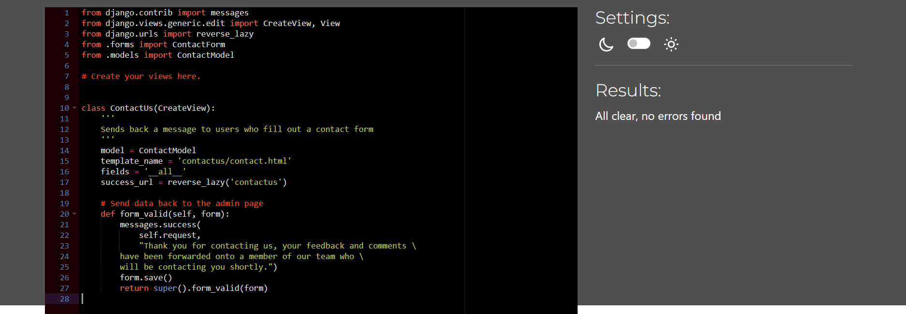
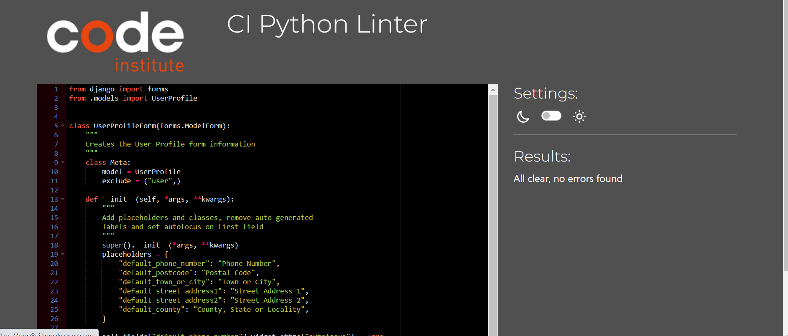
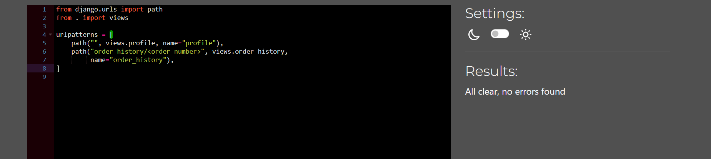

# Project 5 - Prestige|Watches Full Stack Web Developer Ecommerce Project

## Table of content

+ Validation Testing 
    + HTML
        + [NU-HTML-CHECKER](#html-testing-using-nu-html-checker)
    + CSS
        + [W3-JIGSAW.ORG](#css-validator-using-jigsaww3)
    + Javascript 
        + [JShint](#javascript--jquery-using-jshint)
    + Python Pep8 Online Checker
        + Bag App - [Bag App](#bag-app)
        + Checkout App - [Checkout App](#checkout-app)
        + Blog App - [Blog App](#blog-app)
        + Contact Us App - [Contact Us App](#contact-us-app)
        + Home App - [Home App](#home-app)
        + Newsletter App - [Newsletter App](#newsletter-app)
        + Prestige_Watches App - [Main App](#prestige_watches-app)
        + Product App - [Product App](#product-app)
        + Profiles App - [Profiles App](#profile-app)
        + Reviews App - [Reviews App](#reviews-app)
        + Manage.py - [Manage.py](#manage.py)

    
+ Lighthouse Testing 
    + [Home Page](#lighthouse-testing---home-page)
    + [About Us Page](#lighthouse-testing---about-us-page)
    + [Booking Appointment Page](#lighthouse-testing---booking-appointment-page)
    + [Manage Booking Page](#lighthouse-testing---manage-appointment-page)
    + [Contact Us Page](#lighthouse-testing---contact-us-page)

+ [Browser Testing](#browser-testing)
+ [Device Testing](#device-testing)
+ [Manual Testing](#manual-testing)
    + [Home Page](#home-page)
    + [About Us Page](#about-us-page)
    + [Booking Appointment Page](#booking-appointment-page)
    + [Manage Appointment Page](#manage-appointment-page)
    + [Update Appointment Page](#update-appointment-page)
    + [Delete Appointment Page](#delete-appointments-page)
    + [Contact Us Page](#contact-us-page)
    + [Login Page](#login-page)
    + [Register Page](#register-page)
    + [Logout Page](#logout)
    + [Django Admin Page](#admin-page)
    + [404 Error Page](#404-error-page)

+ [Automated Testing](#automated-testing)

+ [Bugs](#bugs)
    + [Fixed Bugs](#fixed-bugs)
    + [Unfixed Bugs](#unfixed-bugs)

## Testing & Validation Checks 

## HTML Testing using NU-HTML-CHECKER

+ Testing Mode - No Warnings and Errors

+ Deployed Mode - No Warnings and Errors

All my pages was checked via nu-html-checker, initally i got 25 errors, mostly due to unclosed div tags or stray tags, these were quickly rectified and the code was rechecked and recieved no errors or warnings. The main error I had was a marquee tag I used for the banner, the marquee is no longer a valid tag and so I had to remove it and change this over. 

## CSS Validator using JIGSAW.W3

+ Base CSS checker by direct input - Found no errors

+ Checkout CSS checker by direct input - Found no errors

+ Full deployed site - Found no errors

## Javascript & JQuery using JSHINT

All my check for Javascript and JQuery was checked using JShint. I received no errors or warning at the time of checking the code. The code was checked by pasting in the relevant scripts in to Jshint and checking for errors. 

+ Jshint Validator

## Python - PEP8 Online checker (Code Institute Version)

All code was checked via the CI Python Linter, all code received no errors and warnings. 

### Bag App

+ For the bag app the CI Python Linter was used to check the python code, for the following files Urls.py, Context.py and Views.py.

### Checkout App

+ For the checkout app the CI Python Linter was used to check the python code, for the following files Urls.py, Context.py, signals, admin, webhooks and views.

### Blog App

+ For the blog app the CI Python Linter was used to check the python code, for the following files Urls.py, signals, widget, admin and views.

### Contact Us App

+ For the contact us app the CI Python Linter was used to check the python code, for the following files Urls.py, signals, widget, admin and views.

### Home App

+ For the home app the CI Python Linter was used to check the python code, for the following files Urls.py and Views.py.

### Newsletter App 

+ For the newsletter app the CI Python Linter was used to check the python code, for the following files Urls.py and Views.py.

### Prestige_Watches App (Main)

+ For the main app the CI Python Linter was used to check the python code, for the following files setting, Urls.py and views.

+ I had few errors/warnings on the settings.py which displayed that some lines were too long, however after getting confirmation from Tutor Support, I was advised these can be left alone, as these were on not to be edited as they were involved with the django auth_password validators. 

### Product App
+ For the main app the CI Python Linter was used to check the python code, for the following files admin, forms, models, urls, views and widgets.

### Profiles App
+ For the main app the CI Python Linter was used to check the python code, for the following files admin, forms, models, urls and views.

### Reviews App
+ For the main app the CI Python Linter was used to check the python code, for the following files admin, forms, models, urls and views.

### Manage.py
+ The manage.py was also checked using the CI Python Linter.

## Lighthouse Testing

